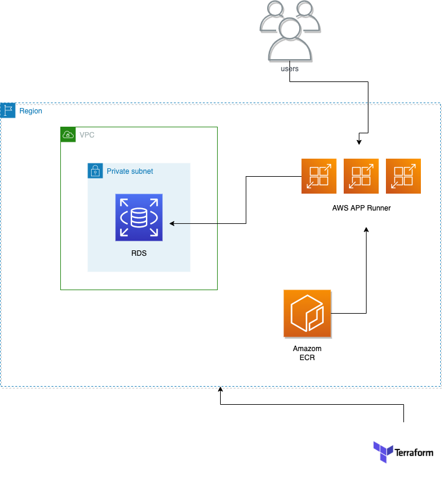

# Orca-Security-Devops-Exercise

## Introduction

This repo will deploy a python service(logging) that logs unique access to the service under AWS account using Terraform,
that will provisioing the following AWS resources:
- AWS ECR
- AWS VPC
- AWS VPC connector
- AWS RDS (postgresql)
- AWS App Runner

AWS App Runner is an AWS service that provides a fast, simple, and cost-effective way to deploy from source code or a container image directly to a scalable and secure web application in the AWS Cloud. [https://aws.amazon.com/apprunner/] (other option that has been consider is Beanstalk).

## Architecture
